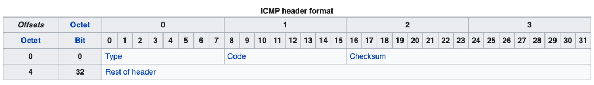

# ICMP-flooder

My own project which send ICMP packets to target IP-address (URL too).

***

## Theory

### ICMP (Internet Control Message Protocol)

The Internet Control Message Protocol (ICMP) is a supporting protocol in the Internet protocol suite. It is used by 
network devices, including routers, to send error messages and operational information indicating success or failure 
when communicating with another IP address, for example, when an error is indicated when a requested service is not 
available or that a host or router could not be reached. ICMP differs from transport protocols such as TCP and UDP 
in that it is not typically used to exchange data between systems, nor is it regularly employed by end-user network 
applications (with an exception of some diagnostic tools like ping and traceroute).

ICMP for IPv4 is defined in RFC 792. A separate ICMPv6, defined by RFC 4443, is used with IPv6.

### Technical details

ICMP is part of the Internet protocol suite as defined in RFC 792. ICMP messages are typically used for diagnostic or 
control purposes or generated in response to errors in IP operations (as specified in RFC 1122). ICMP errors are 
directed to the source IP address of the originating packet.

For example, every device (such as an intermediate router) forwarding an IP datagram first decrements the time to 
live (TTL) field in the IP header by one. If the resulting TTL is 0, the packet is discarded and an ICMP time exceeded 
in transit message is sent to the datagram's source address.

Many commonly used network utilities are based on ICMP messages. The traceroute command can be implemented by 
transmitting IP datagrams with specially set IP TTL header fields, and looking for ICMP time exceeded in transit and 
Destination unreachable messages generated in response. The related ping utility is implemented using the ICMP echo 
request and echo reply messages.

ICMP uses the basic support of IP as if it were a higher-level protocol, however, ICMP is actually an integral part 
of IP. Although ICMP messages are contained within standard IP packets, ICMP messages are usually processed as a 
special case, distinguished from normal IP processing. In many cases, it is necessary to inspect the contents of the 
ICMP message and deliver the appropriate error message to the application responsible for transmitting the IP packet 
that prompted the ICMP message to be sent.

ICMP is a network-layer protocol. There is no TCP or UDP port number associated with ICMP packets as these numbers 
are associated with the transport layer above.


### Datagram structure

The ICMP packet is encapsulated in an IPv4 packet. The packet consists of header and data sections.



**Header**

The ICMP header starts after the IPv4 header and is identified by IP protocol number '1'.All ICMP packets have 
an 8-byte header and variable-sized data section. The first 4 bytes of the header have fixed format, while the last
4 bytes depend on the type/code of that ICMP packet.

**Type**

ICMP type, see Control messages.

**Code**

ICMP subtype, see Control messages.

**Checksum**

Internet checksum (RFC 1071) for error checking, calculated from the ICMP header and data with value 0 substituted for this field.

**Rest of header**

Four-byte field, contents vary based on the ICMP type and code.

### Data

ICMP error messages contain a data section that includes a copy of the entire IPv4 header, plus at least the first
The variable size of the ICMP packet data section has been exploited. In the "Ping of death", large or fragmented ICMP 
packets are used for denial-of-service attacks. ICMP data can also be used to create covert channels for communication. 
These channels are known as ICMP tunnels.

*All these data has been got from Wikipedia [ICMP](https://en.wikipedia.org/wiki/Internet_Control_Message_Protocol)*

***

## Installation

```shell
    python3 -m pip install -r requirements.txt
```

or 

```shell
    pip3 install -r requirements.txt
```

## Usage

```bazaar

usage: ./launch.py MODE {gui | cmd}
                
    Mods details (Select one of those methods and '--help' to get more information about options):
        1. gui  - Allow you to run project with GUI interface;
        2. cmd  - Run project into terminal (options see further).
        

This simple python project provides ability to flood by sending ICMP-packets to specified target IP/URL-address, port. Also you may set length, frequency of generated ICMP-packet.

optional arguments:
    -h, --help  show this help message and exit

Script Modes:
    {gui,cmd}
    gui       launch with GUI
    cmd       launch from terminal

optional arguments:
    -h, --help  show this help message and exit
    -i          Enter target ip-address.
    -u          Enter target url address.
    -p          Enter port number.
    -l          Enter lenght of ICMP-packet to build.
    -f          Enter frequence timeout to send packet.
```

